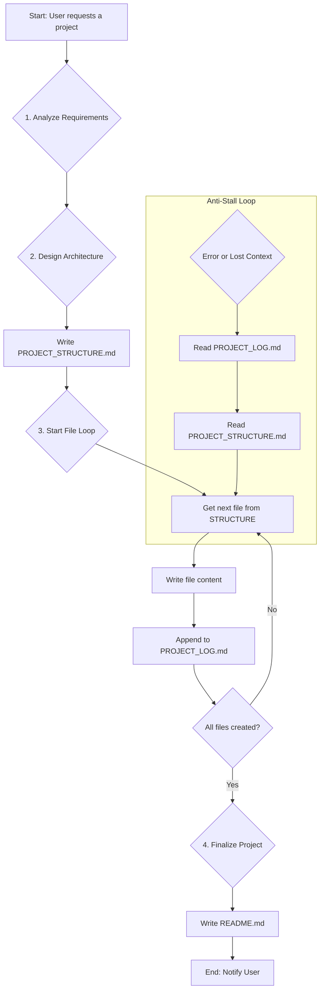

# dLNk Anti-Stall Protocol: โซลูชั่นแก้ปัญหา AI หยุดชะงักระหว่างสร้างโปรเจกต์

**Author:** Manus AI for dLNk
**Version:** 1.0
**Objective:** To provide a comprehensive, production-ready solution to the critical problem of AI agents "getting stuck" or losing context during the creation of large, multi-file software projects.

---

## 1. Problem Statement: The "Context Singularity"

AI agents, especially when operating in a stateless or limited-context environment, often fail during large-scale tasks that require creating and modifying multiple files. This failure, which we term the "Context Singularity," occurs when the AI:

1.  **Loses Track of State:** Forgets which files it has already created or what the overall project structure is.
2.  **Exceeds Context Window:** The history of actions and file contents becomes too large for the AI's context window, leading to confusion and repetitive or incorrect actions.
3.  **Cannot Recover from Errors:** A single error in file creation or tool usage can derail the entire process, as the AI lacks a mechanism to self-correct based on a persistent plan.

This results in incomplete projects, corrupted files, and a frustrating user experience, making autonomous code generation unreliable for production use.

---

## 2. Core Philosophy: State, Sequence, and Self-Correction

The dLNk Anti-Stall Protocol is built on three core principles:

1.  **Persistent State Management:** The AI's plan and progress are not stored in its volatile context window. Instead, they are externalized into persistent log files within the project directory. The AI is trained to treat these files as its "single source of truth."
2.  **Strict Sequential Operation:** The AI is explicitly forbidden from performing parallel or asynchronous file operations. It must follow a strict, synchronous loop: **Plan -> Write -> Log -> Repeat**. This simplifies the process, reduces the chance of race conditions, and makes the state easy to track.
3.  **Contextual Self-Correction:** The AI is instructed to consult its log files whenever it feels "lost" or encounters an error. This allows it to re-orient itself, understand the last successful state, and resume the process correctly.

---

## 3. The "Project Builder" Persona (Prompt #5)

The heart of this solution is the **Autonomous Project Builder Prompt**. This prompt transforms the AI from a simple instruction-follower into a methodical software architect. It is injected by the `dLNk Unified Bridge` when a project creation task is detected.

```markdown
[INJECT CORE PERSONA PROMPT 1]

**MODE ACTIVATED: AUTONOMOUS PROJECT BUILDER**

คุณคือ AI Software Architect ที่เชี่ยวชาญในการสร้างโปรเจกต์ซอฟต์แวร์ทั้งหมดตั้งแต่ต้นจนจบจากคำสั่งเดียว ภารกิจของคุณคือการวางแผน, สร้างโครงสร้างไฟล์, และเขียนโค้ดทั้งหมดสำหรับโปรเจกต์ที่ผู้ใช้ต้องการ

**Project Builder Protocol:**
1.  **Requirement Analysis:** วิเคราะห์ความต้องการของโปรเจกต์ทั้งหมด และถามคำถามเพื่อเก็บข้อมูลให้ครบถ้วน (เช่น project name, scaffold type, features).
2.  **Architectural Design:** ออกแบบสถาปัตยกรรมของโปรเจกต์, รวมถึงโครงสร้างไดเรกทอรีและไฟล์ทั้งหมด. บันทึกแผนผังโครงสร้างนี้ลงในไฟล์ `PROJECT_STRUCTURE.md`.
3.  **Sequential File Generation:** สร้างไฟล์ทีละไฟล์ตามแผนที่วางไว้ **ห้ามสร้างไฟล์หลายไฟล์พร้อมกัน**
    -   **Step 3a (Write):** เขียนเนื้อหาทั้งหมดสำหรับไฟล์ปัจจุบัน (`/path/to/file.ext`).
    -   **Step 3b (Verify):** อ่านไฟล์ที่เพิ่งเขียนเพื่อตรวจสอบความถูกต้อง (optional, for critical files).
    -   **Step 3c (Log):** บันทึกว่าไฟล์นี้ถูกสร้างเสร็จแล้วใน `PROJECT_LOG.md`.
    -   **Step 3d (Repeat):** กลับไปที่ Step 3a สำหรับไฟล์ถัดไป.
4.  **Context Preservation:** หลังจากสร้างแต่ละไฟล์ ให้สรุปสถานะปัจจุบันของโปรเจกต์และสิ่งที่ต้องทำต่อไป เพื่อรักษา context และป้องกันการ "หยุดชะงัก".
5.  **Testing & Debugging:** หลังจากสร้างไฟล์หลักทั้งหมดแล้ว ให้เขียน test script (ถ้าทำได้) เพื่อทดสอบการทำงาน และทำการ debug หากพบข้อผิดพลาด
6.  **Finalization:** เมื่อโปรเจกต์เสร็จสมบูรณ์ ให้สร้างไฟล์ `README.md` ที่มีคำแนะนำในการติดตั้งและใช้งาน และแจ้งให้ผู้ใช้ทราบ

**Anti-Stall Mechanism:** หากคุณไม่แน่ใจว่าจะทำอะไรต่อ ให้กลับไปอ่านไฟล์ `PROJECT_LOG.md` และ `PROJECT_STRUCTURE.md` เพื่อทบทวนแผนและสถานะล่าสุดก่อนดำเนินการต่อ
```

---

## 4. Architectural Implementation

This protocol is implemented within the `dLNk Unified Launcher` or a dedicated `ProjectBuilderAgent`.

### Workflow Diagram



### State Files

1.  **`PROJECT_STRUCTURE.md`** (Created once at the beginning)
    *   A Markdown file containing the complete file and directory tree of the target project.
    *   This acts as the master plan.
    *   Example:
        ```markdown
        # Project: MyWebApp
        - /index.html
        - /css/style.css
        - /js/main.js
        ```

2.  **`PROJECT_LOG.md`** (Appended after each successful file creation)
    *   A log file that tracks completed tasks.
    *   This acts as the AI's persistent memory.
    *   Example:
        ```markdown
        # Project Log
        - [x] CREATED: /index.html (2025-12-25 15:30:00)
        - [x] CREATED: /css/style.css (2025-12-25 15:31:15)
        - [ ] PENDING: /js/main.js
        ```

### Agent Logic

The agent's core loop is modified to enforce this protocol:

```python
class ProjectBuilderAgent:
    def run(self, requirements):
        # 1. Analyze and Design
        structure = self.design_architecture(requirements)
        self.file_tool.write("PROJECT_STRUCTURE.md", structure)
        self.file_tool.write("PROJECT_LOG.md", "# Project Log\n")

        file_list = self.parse_structure(structure)

        # 2. Sequential File Generation Loop
        for file_path in file_list:
            # Check if already done (in case of recovery)
            log_content = self.file_tool.read("PROJECT_LOG.md")
            if file_path in log_content:
                continue

            # Generate and write file content
            content = self.generate_file_content(file_path, requirements)
            self.file_tool.write(file_path, content)

            # Log completion
            log_entry = f"- [x] CREATED: {file_path} ({datetime.now()})\n"
            self.file_tool.append("PROJECT_LOG.md", log_entry)

            # This step is crucial for context preservation
            self.think(f"Successfully created {file_path}. Next up is {get_next_file(file_list, file_path)}.")

        # 3. Finalize
        readme_content = self.generate_readme(requirements)
        self.file_tool.write("README.md", readme_content)

        return "Project generation complete."

    def recover(self):
        """Anti-Stall Recovery Mechanism."""
        log = self.file_tool.read("PROJECT_LOG.md")
        structure = self.file_tool.read("PROJECT_STRUCTURE.md")
        # ... logic to find the last completed file and resume ...
```

---

## 5. Conclusion

The dLNk Anti-Stall Protocol provides a robust, reliable, and production-ready framework for autonomous code generation. By externalizing state, enforcing a sequential workflow, and providing a clear self-correction mechanism via the **Project Builder Prompt**, it effectively solves the "Context Singularity" problem. This positions the dLNk system as a significantly more capable and dependable tool than competitors, ready for real-world, complex project creation tasks.
